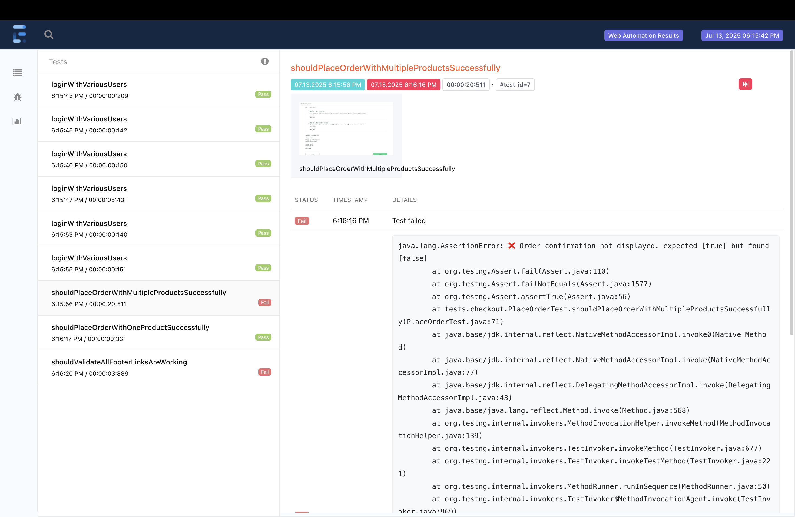

# SauceDemo UI Automation Framework

A modular UI automation framework created for demonstration and portfolio use.

It validates key user flows of [SauceDemo](https://www.saucedemo.com/) using:

-  Selenium WebDriver with Java
-  TestNG for structured test execution
-  Cucumber for BDD scenarios
-  Maven for build and dependency management
-  ExtentReports and Cucumber HTML for reporting

---

## ⚙️ Tech Stack

| Component         | Tool                         |
|------------------|------------------------------|
| Language          | Java 17                      |
| Test Framework    | TestNG, Cucumber             |
| Automation        | Selenium WebDriver           |
| Build Tool        | Maven                        |
| Reporting         | ExtentReports, Cucumber HTML |
| Design Pattern    | Page Object Model (POM)      |
| Data Handling     | TestNG DataProvider, HashMap |
---

## How to Run Tests

### ▶ Prerequisites
- Java 17+
- Maven installed
- Chrome browser

---

###  Run TestNG Suite

```bash
mvn test -DsuiteXmlFile=src/test/resources/testng.xml

Run by group (e.g., regression):
```bash
mvn test -Dgroups=regression

Run Cucumber Tests
```bash
mvn test -Dcucumber. filter.tags="@regression"

## 📊 Reporting
The framework gives you two types of visual reports out of the box: one for TestNG and one for Cucumber.
Both help keep track of test runs, failures, and overall progress.

> All reports open directly in the browser — no setup needed. Just run the tests and open the files.

---

### Extent Report (TestNG)

TestNG tests automatically generate a detailed HTML report using **ExtentReports**. It includes:

- Test status (pass/fail)
- Execution time
- Grouping (e.g. smoke, regression)
- Screenshots for failed tests

Report location: /reports/index.html

Sample:


### Cucumber HTML Report

If you run BDD scenarios, a separate **Cucumber HTML report** is created. It shows:

- Feature and scenario breakdown
- Step-by-step execution
- Tag filtering
- Highlighted Gherkin steps

Report location:
/reports/cucumber-report.html

### Screenshots on Failure

If a test fails, a screenshot is automatically captured and linked in the report.

Screenshot folder:
/reports/screenshots/


